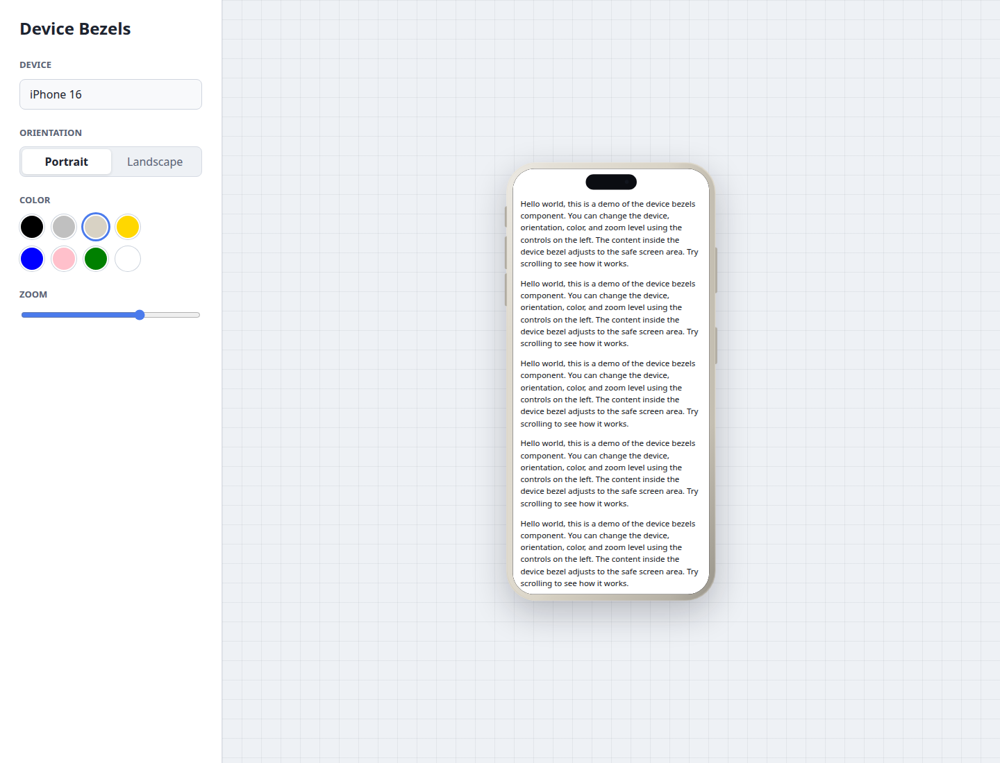
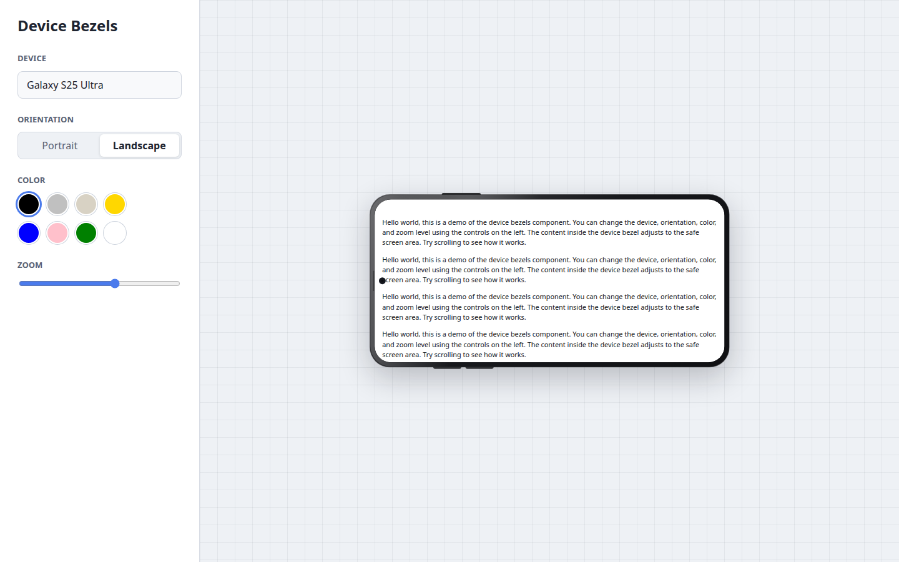

# react-device-bezels

Pure SCSS React device bezels for iOS and Android phones, tablets, and foldables.

`react-device-bezels` renders realistic device shells around any React content. Use it for app previews, product pages, documentation, screenshots, portfolios, launch pages, or internal design tools.





## Highlights

- Pure SCSS/CSS bezels, no device image assets required
- Works with JSX, screenshots, videos, canvases, and any React children
- Safe-area-aware scroll container for Dynamic Island, notches, punch-hole cameras, and landscape cutouts
- iOS and Android phones, tablets, and foldables
- Device color, orientation, zoom, and custom screen dimensions
- Typed React API with ESM, CJS, and TypeScript declarations
- Compiled CSS and source SCSS exports

## Install

```sh
npm install react-device-bezels
```

## Quick Start

```tsx
import { DeviceFrame } from "react-device-bezels";
import "react-device-bezels/styles.css";

export function Preview() {
  return (
    <DeviceFrame device="iphone-16" color="natural">
      <main style={{ display: "grid", gap: 16 }}>
        <h1>Dashboard</h1>
        <p>This is real JSX rendered inside the device screen.</p>
        <button type="button">Create report</button>
      </main>
    </DeviceFrame>
  );
}
```

## Screenshot Usage

For full-bleed screenshots, pass an image as the child and make it fill the screen.

```tsx
import { DeviceFrame } from "react-device-bezels";
import "react-device-bezels/styles.css";

export function ScreenshotPreview() {
  return (
    <DeviceFrame device="pixel-9-pro" color="black">
      
    </DeviceFrame>
  );
}
```

## JSX Content

Children render inside `.df-device__content`, a safe-area-aware scroll container. Content avoids the notch, island, punch-hole camera, and landscape cutouts automatically. Scrollbars are hidden by default while scrolling remains enabled.

```tsx
<DeviceFrame device="iphone-16-pro" color="natural">
  {({ device, orientation }) => (
    <section>
      <p>{device.label}</p>
      <p>{orientation}</p>
    </section>
  )}
</DeviceFrame>
```

Use `screenClassName` or `screenStyle` for the full screen surface. Use `contentClassName` or `contentStyle` for the scrollable inner content.

## API

```tsx
type DeviceFrameProps = {
  device?: DeviceName;
  color?: DeviceColor | string;
  orientation?: "portrait" | "landscape";
  landscape?: boolean;
  width?: number | string;
  height?: number | string;
  zoom?: number;
  className?: string;
  frameClassName?: string;
  screenClassName?: string;
  contentClassName?: string;
  style?: React.CSSProperties;
  screenStyle?: React.CSSProperties;
  contentStyle?: React.CSSProperties;
  children?: React.ReactNode | ((props: DeviceFrameRenderProps) => React.ReactNode);
};
```

| Prop | Default | Description |
| --- | --- | --- |
| `device` | `"iphone-15"` | Preset device name. |
| `color` | Device default | Preset color name or any CSS color value. |
| `orientation` | `"portrait"` | `"portrait"` or `"landscape"`. |
| `landscape` | `false` | Convenience boolean for landscape orientation. |
| `width` | Preset width | Custom screen width before bezel chrome. |
| `height` | Preset height | Custom screen height before bezel chrome. |
| `zoom` | `1` | Scales the rendered device. |
| `className` | - | Class for the outer wrapper. |
| `frameClassName` | - | Class for the hardware shell. |
| `screenClassName` | - | Class for the clipped screen surface. |
| `contentClassName` | - | Class for the safe, scrollable content layer. |
| `style` | - | Inline styles and CSS variables for the outer wrapper. |
| `screenStyle` | - | Inline styles for the screen surface. |
| `contentStyle` | - | Inline styles for the scrollable content layer. |
| `children` | - | React content or a render function. |

## Devices

`DeviceName` is inferred from `DEVICE_PRESETS`, so the TypeScript type always matches the exported preset list.

```tsx
import { DEVICE_PRESETS } from "react-device-bezels";

const devices = DEVICE_PRESETS.map((device) => device.name);
```

The package currently includes 76 presets across these families:

- iPhone 16, 15, 14, 13, 12, 11, X/XR, 8 Plus, and SE
- iPad Pro, iPad Air, iPad, and iPad Mini
- Google Pixel 9, 8, 7, 6, Fold, and Pixel Tablet
- Samsung Galaxy S25, S24, S23, S22, Z Flip, Z Fold, and Galaxy Tab
- OnePlus 13, 12, and Open
- Xiaomi 15, 15 Ultra, and 14

## Styling

Import compiled CSS:

```tsx
import "react-device-bezels/styles.css";
```

Or import source SCSS:

```scss
@use "react-device-bezels/styles.scss";
```

The outer element exposes CSS variables for advanced customization:

```tsx
<DeviceFrame
  device="galaxy-s25-ultra"
  orientation="landscape"
  color="#1d2128"
  style={{
    "--df-bezel": "12px",
    "--df-frame-radius": "28px",
  } as React.CSSProperties}
/>
```

## Examples

Portrait iPhone with JSX:

```tsx
<DeviceFrame device="iphone-16" color="natural" zoom={0.72}>
  <YourApp />
</DeviceFrame>
```

Landscape Android preview:

```tsx
<DeviceFrame device="galaxy-s25-ultra" orientation="landscape" color="black">
  <video src="/demo.mp4" autoPlay muted loop />
</DeviceFrame>
```

Custom dimensions:

```tsx
<DeviceFrame device="iphone-16" width={390} height={844} color="#d8d2c4">
  <CanvasPreview />
</DeviceFrame>
```

## Development

```sh
npm install
npm run dev
npm run check
```

`npm run check` typechecks the package, builds ESM/CJS/type declarations, compiles CSS, and runs an npm pack dry-run.

## Package Exports

```tsx
import { DeviceFrame, DEVICE_PRESETS } from "react-device-bezels";
import "react-device-bezels/styles.css";
```

```scss
@use "react-device-bezels/styles.scss";
```

## Notes

- Frames are CSS approximations intended for previews and mockups, not exact CAD/device templates.
- Screen sizes are logical CSS viewport dimensions, not physical hardware pixels.
- Android viewport dimensions can vary by browser, display size, and user scaling settings.

## License

MIT
